# ZB Idea Manager: Documentation

ZB Idea Manager is a mobile-first web app where verified ZB Group employees post ideas, respond to challenges set by executives, and follow each idea from first sketch to launch. Executives review ideas with an AI-style ranking and approve the best ones.

> **Status.** The web app in `index.html` is a working **prototype**: one static file with sample data held in memory. Section 9 (WhatsApp chatbot) and Section 10 (production architecture) are **design specifications**. They are not built yet.

**Contents**

1. [Overview and roles](#1-overview-and-roles)
2. [Feature guide](#2-feature-guide)
3. [Idea lifecycle](#3-idea-lifecycle)
4. [Data model](#4-data-model)
5. [Ranking engine](#5-ranking-engine)
6. [Key flows](#6-key-flows)
7. [Prototype architecture](#7-prototype-architecture)
8. [Running and deploying](#8-running-and-deploying)
9. [WhatsApp chatbot (specification)](#9-whatsapp-chatbot-specification)
10. [Production architecture (target)](#10-production-architecture-target)
11. [Security and privacy](#11-security-and-privacy)
12. [Roadmap and known limitations](#12-roadmap-and-known-limitations)

---

## 1. Overview and roles

| Role | Who | What they can do |
|---|---|---|
| **Employee** | Any verified `@zb.co.zw` user | Post ideas, attach documents and images, like, comment, share, save, chat with members, respond to challenges |
| **Executive** | Admin users, shown with a blue verified tick | Everything an employee can do, plus set challenges, see insights, use AI ranking, approve ideas, change an idea's stage, view all users and the email log |

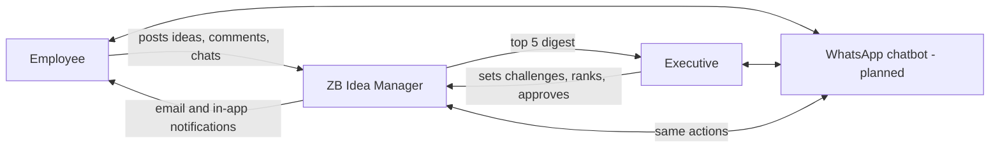

## 2. Feature guide

### For everyone
- **Sign in.** ZB work email, then a 6-digit code. The session is remembered in the browser, so a refresh does not log you out. *Sign out* clears it.
- **Home feed.** Two tabs: *For you* (ranked by your department, challenge relevance, engagement and recency) and *Latest*. Filter by stage; search by title or text.
- **Idea cards.** Author (executives carry a blue tick), department, age, stage tag, summary, optional image, challenge chip, document count, and like / comment / share / save.
- **Idea page.** Full text, images, stage tracker, supporting documents, comments.
- **Post an idea.** The floating **+** button opens the form: title, summary, body, stage, challenge, documents.
- **Challenges.** Executive briefs with keywords and a deadline. Ideas can answer a challenge.
- **Chat.** One-to-one messages with any member. On phones the open conversation is full screen.
- **Activity.** Notifications such as approvals, replies and new challenges, with an unread badge.
- **Members and profiles.** Directory of verified staff; each profile shows bio and ideas. You can change your own photo and details.

### For executives
- **AI ranking.** Scores every idea against a chosen challenge; weights are adjustable. The top five are highlighted.
- **Approve.** Approving an idea emails the author and adds an Activity item.
- **Email me the top 5.** Sends the current top five as a digest.
- **Insights, All users, Email log.** Reporting and audit screens.
- **Stage control.** Move an idea along Idea, Prototype, Demo, Pilot, Launched.

### Screens and navigation

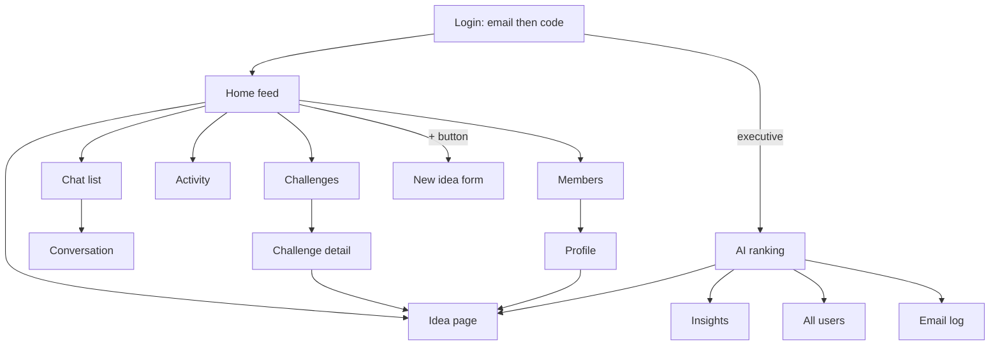

## 3. Idea lifecycle

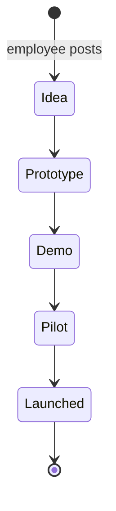

Approval is a flag on the idea, set by an executive. It is independent of the five stages, so an idea can be Approved while still at Prototype.

## 4. Data model

The prototype keeps these objects in memory. A real backend would store them as tables.

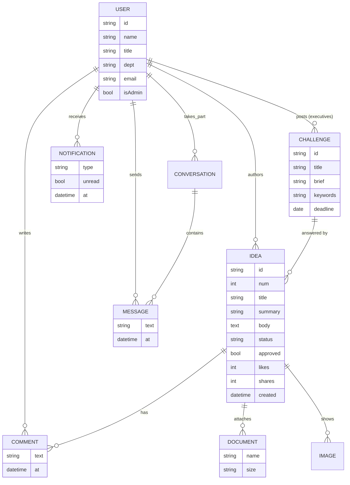

Idea codes are shown as `ZB-IDEA-0141` (from `num`).

## 5. Ranking engine

Every idea gets three sub-scores from 0 to 100 and a weighted total.

| Sub-score | How it is computed |
|---|---|
| **Fit** (relevance) | Share of the challenge's keywords found in the idea text. Ideas that answered the challenge get a boost. With no challenge selected, ideas that belong to a challenge use that challenge; others get a neutral 35. |
| **Likes and comments** (engagement) | `likes + 3 x comments + 2 x shares`, scaled so the most engaged idea scores 100. |
| **Idea quality** | Length of the write-up (up to 45), attached documents (up to 30) and stage progress (6 per stage). |

`total = (wFit x fit + wEng x engagement + wQuality x quality) / (wFit + wEng + wQuality)`

The weights are the three sliders on the ranking screen (default 40 / 35 / 25).

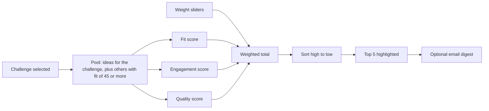

> The prototype uses this formula as a stand-in for a trained model. See the roadmap for replacing it.

## 6. Key flows

### 6.1 Sign in

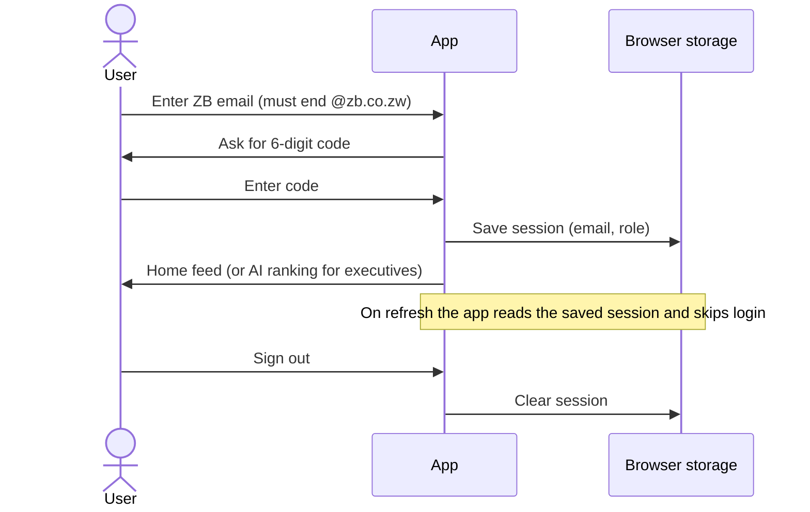

> The prototype accepts any six digits. Production must send and check a real one-time code.

### 6.2 Posting and responding to an idea

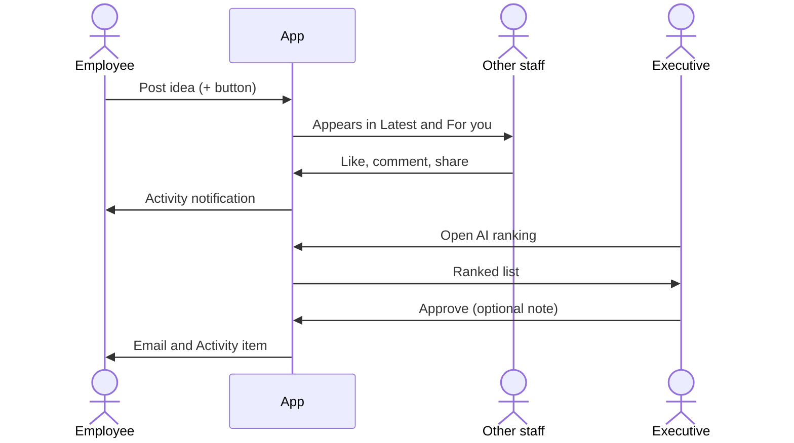

### 6.3 Executive approval

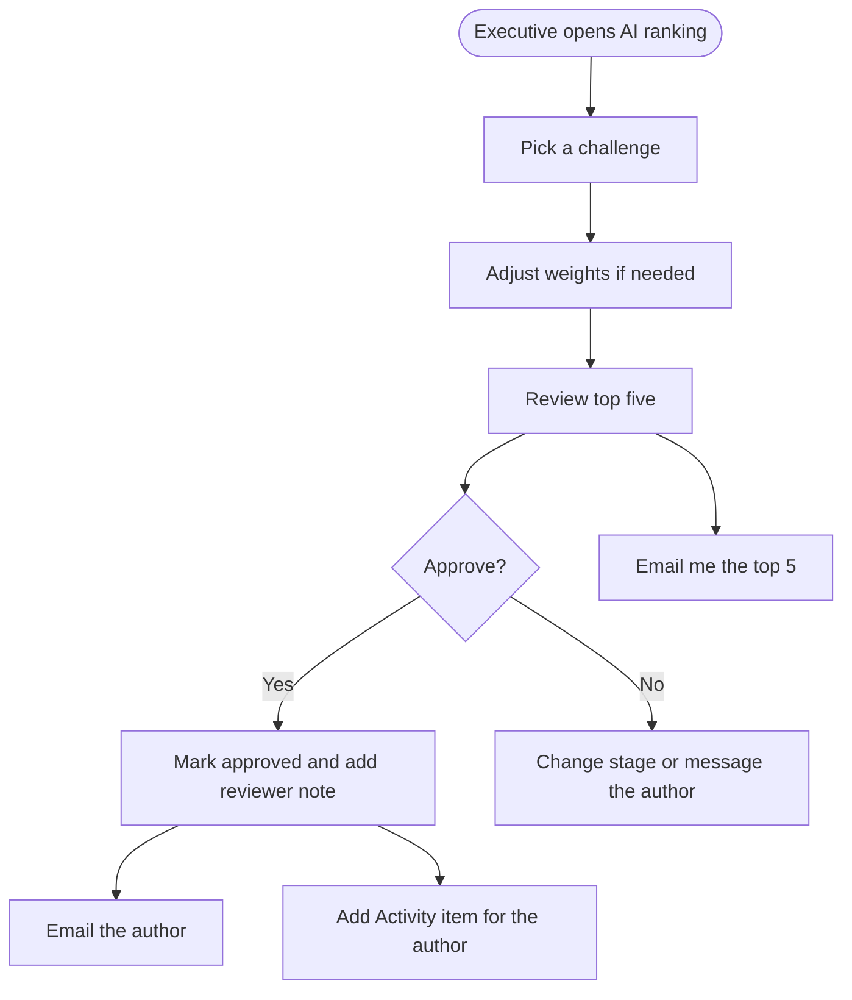

## 7. Prototype architecture

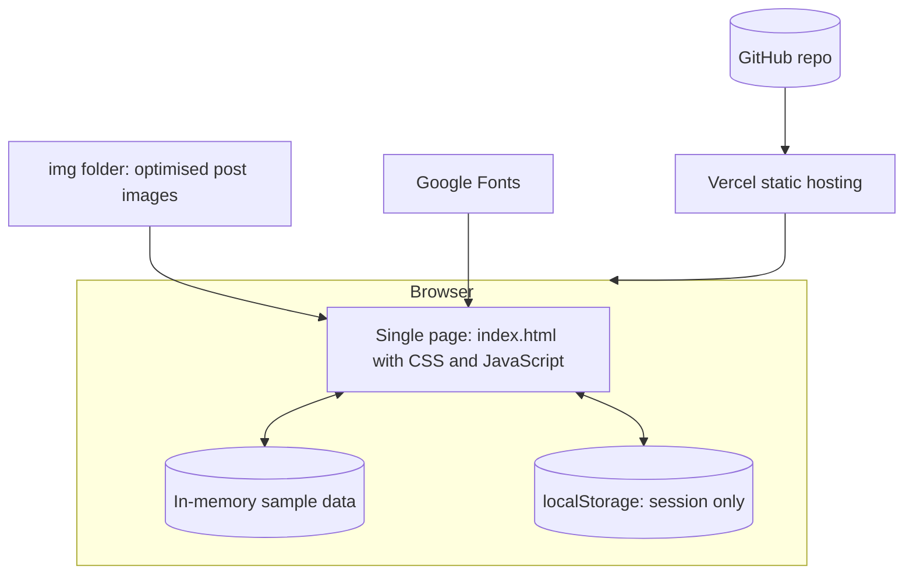

Key points
- One file, no build step, no dependencies. `render()` redraws the whole view from a state object `S` after every action.
- **Nothing is saved on a server.** New posts, likes, comments, chats and approvals vanish on refresh. Only the sign-in session survives.
- Emails are simulated: they appear in the Email log screen; no mail is sent.
- Images live in `img/` as resized JPEGs (about 100 to 170 KB each). The originals in `posts/` should not be committed.

Repository layout

```
index.html          the whole app
img/                post images used by sample ideas
docs/               this documentation
posts/              original large images (keep out of git)
```

## 8. Running and deploying

**Run locally** (any static server works):

```bash
python -m http.server 8123
```

Then open `http://localhost:8123/index.html`. Use any `@zb.co.zw` address and any six digits. Choose *Executive admin* on the login screen to see the executive view.

**Deploy.** Push to GitHub; Vercel serves the repository as a static site (current site: `zb-idea-manager.vercel.app`). If a change does not show after deploying, refresh once to clear the cached copy.

## 9. WhatsApp chatbot (specification)

**Goal.** Let staff who are away from a laptop use the Idea Manager from WhatsApp: post an idea in a short conversation, check on their ideas, browse top ideas and respond, and receive notifications. Executives can review and approve from their phones.

### 9.1 What the bot can do

| # | Feature | Who | Example |
|---|---|---|---|
| 1 | **Link account** | All | "Hi", then the bot asks for the work email, sends a code by email, and the user replies with the code |
| 2 | **Post an idea** | All | "New idea": the bot asks for a title, a short summary, details, an optional challenge, and an optional photo or document |
| 3 | **My ideas** | All | "My ideas" lists each idea with stage, likes, comments and approval status |
| 4 | **Browse and respond** | All | "Top ideas" returns five ideas with Like / Comment / Open buttons |
| 5 | **Challenges** | All | "Challenges" lists open challenges and deadlines; the user can answer one |
| 6 | **Notifications** | All | A message when an idea is approved or commented on, or when a new challenge opens |
| 7 | **Executive review** | Executives | "Top 5" returns the ranked list with an **Approve** button and an optional note |
| 8 | **Help and opt-out** | All | "Help", "Stop notifications", "Unlink" |

Out of scope for the first version: chat between members, editing profiles, and large documents (the bot sends a link to the web app instead).

### 9.2 System context

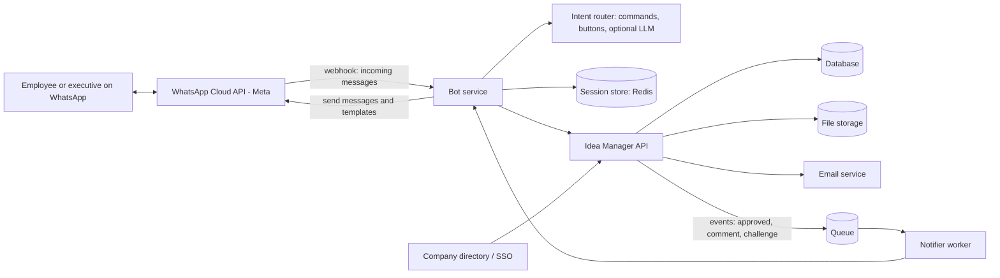

### 9.3 Linking a WhatsApp number to a ZB account

Only linked numbers can use the bot. Linking proves the person owns the ZB email.

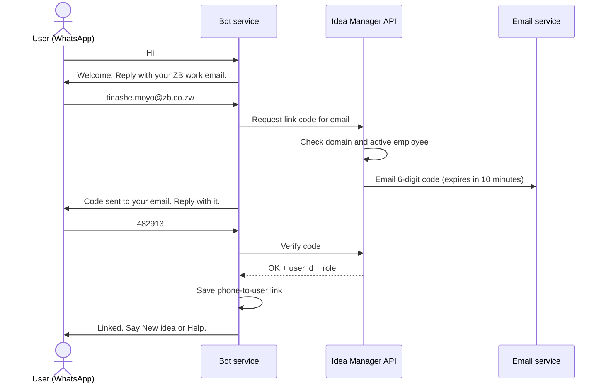

Rules: 5 code attempts, then a 30-minute lockout; one active number per user; unlinking is available at any time.

### 9.4 Posting an idea by chat

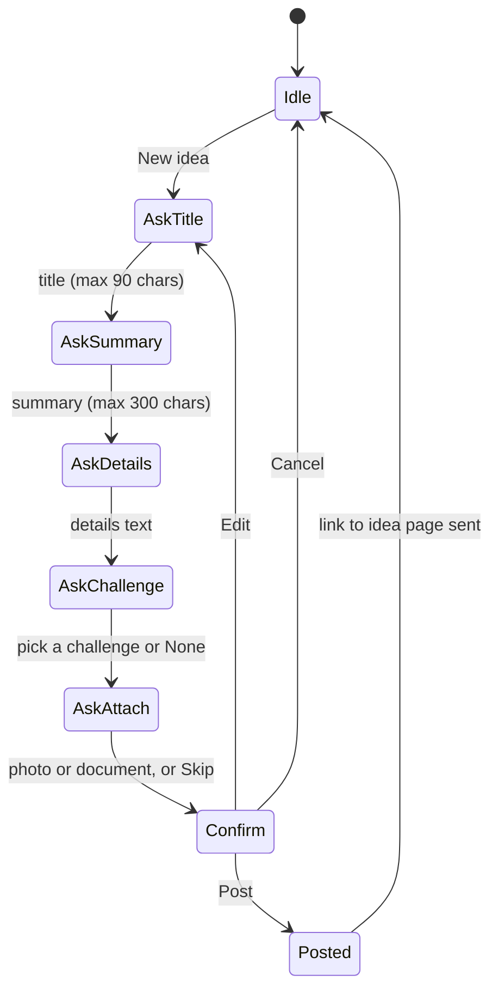

Typing "cancel" at any step returns the user to Idle.

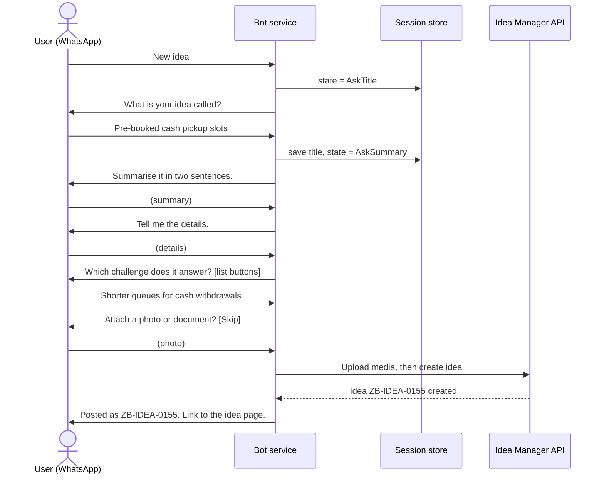

Sessions expire after 30 minutes of silence; the draft is kept for 24 hours so the user can resume ("Continue my idea").

### 9.5 Message routing

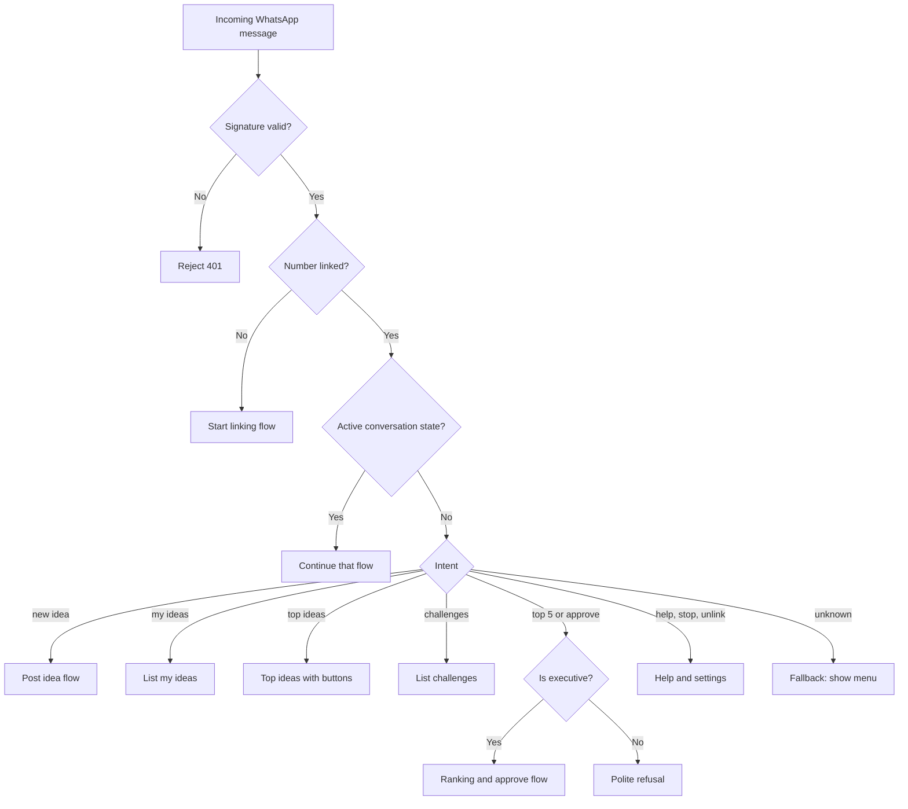

Intent matching uses fixed commands and button replies first. An optional LLM step can map free text such as "I have an idea about queues" to an intent. It must never post, like or approve anything without a confirmation reply.

### 9.6 Notifications

WhatsApp only allows free-form messages within 24 hours of the user's last message. Everything else must use **pre-approved message templates**.

| Event | Template (example) | Recipient |
|---|---|---|
| Idea approved | "Good news {{1}}: your idea {{2}} was approved. Note: {{3}}" | Author |
| New comment | "{{1}} commented on {{2}}: {{3}}" | Author |
| New challenge | "New challenge from {{1}}: {{2}}. Deadline {{3}}." | All opted-in staff |
| Daily top 5 | "Your top 5 ideas for {{1}} are ready. Reply TOP5 to view." | Executives |

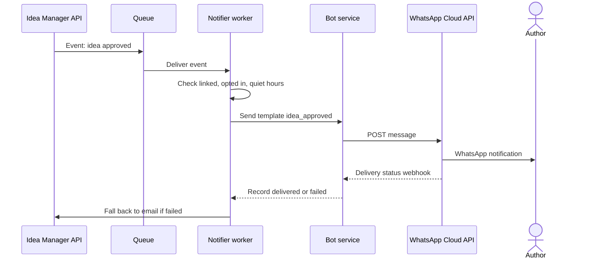

### 9.7 Executive approval on WhatsApp

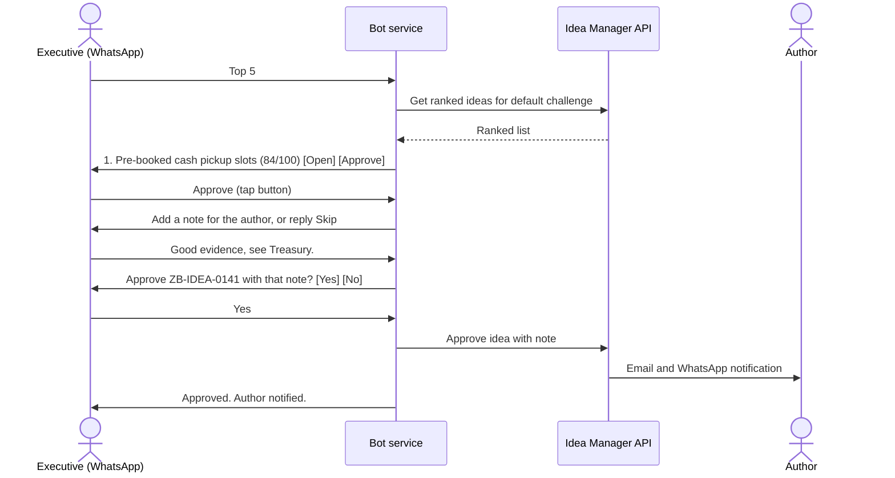

### 9.8 Sample conversation

```
User:  Hi
Bot:   Welcome to ZB Ideas. Reply with your ZB work email to link your account.
User:  tinashe.moyo@zb.co.zw
Bot:   I sent a 6-digit code to that address. Reply with it here.
User:  482913
Bot:   Linked. What would you like to do?
       [New idea]  [My ideas]  [Top ideas]
User:  New idea
Bot:   What is your idea called?
...
Bot:   Posted as ZB-IDEA-0155. You will be told here when someone responds.
```

### 9.9 Technical requirements

| Area | Decision |
|---|---|
| Channel | WhatsApp Business Platform (Cloud API) with a verified ZB business number |
| Webhook | HTTPS endpoint; verify Meta's signature on every request; respond within 5 seconds and process work in a queue |
| Runtime | Node.js or Python service on the same cloud as the API |
| State | Redis for conversation state and draft ideas (TTL as above) |
| Identity | Phone number mapped to user id after email-code verification |
| Media | Download from Meta, virus-scan, store in file storage, then attach to the idea |
| Rate limits | Max 20 messages per minute per user; back off on Meta 429 responses |
| Languages | English first; Shona and Ndebele as a later extension |
| Logging | Store message ids, intents and outcomes; keep message text only as long as needed |

Webhook payload (simplified) that the service must handle:

```json
{
  "entry": [{
    "changes": [{
      "value": {
        "messages": [{
          "from": "2637XXXXXXXX",
          "id": "wamid.HBg...",
          "type": "text",
          "text": { "body": "New idea" }
        }]
      }
    }]
  }]
}
```

### 9.10 Suggested API additions

| Endpoint | Purpose |
|---|---|
| `POST /link/request` and `POST /link/verify` | Email-code linking for a phone number |
| `POST /ideas` | Create an idea (from web or bot) |
| `GET /ideas?mine=1` and `GET /ideas/top` | Lists for the bot |
| `POST /ideas/{id}/like` and `POST /ideas/{id}/comments` | Respond to ideas |
| `GET /challenges?open=1` | Open challenges |
| `GET /ranking?challenge=...` | Ranked list (executives) |
| `POST /ideas/{id}/approve` | Approve with a note (executives) |
| `POST /webhooks/whatsapp` | Receive messages and delivery statuses |

### 9.11 Acceptance criteria

- A new user can link their number and post an idea in under three minutes without opening the web app.
- Unlinked numbers can only start linking; they cannot read any idea.
- Non-executives cannot see ranking or approve, even by typing the command.
- Every post, like, comment and approval is confirmed back in the chat.
- A failed WhatsApp notification falls back to email.
- "Stop" and "Unlink" take effect immediately.

## 10. Production architecture (target)

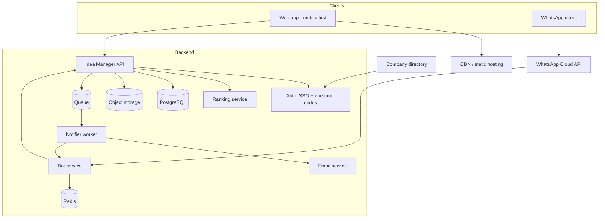

Replace-the-prototype checklist

| Prototype | Production |
|---|---|
| In-memory data | PostgreSQL |
| Any 6 digits accepted | Real one-time codes, SSO with the company directory |
| Documents stored as names only | Upload, virus scan, store, preview |
| Simulated emails | Real email service and delivery logs |
| Formula ranking | Trained model with the same three inputs and a feedback loop |
| Single HTML file | Front-end project with build and tests |

## 11. Security and privacy

- Only verified `@zb.co.zw` staff can sign in; a WhatsApp number is linked only after email verification.
- Executive features are enforced on the server, not just hidden in the interface.
- Verify WhatsApp webhook signatures; reject anything unsigned.
- Keep phone numbers and message content to the minimum needed; set a retention period; allow unlink and delete.
- Notifications are opt-in and have quiet hours.
- Keep customer data out of ideas and chat; remind users in the posting flow.
- Log approvals and stage changes for audit.
- Treat every uploaded file as untrusted: type checks, size limit, malware scan.

## 12. Roadmap and known limitations

**Known limitations of the prototype**
- Data resets on refresh (except the sign-in session).
- No real email, no real code check, no real file upload.
- The ranking formula is a stand-in for a trained model.
- The document viewer shows file names only.

**Suggested order of work**

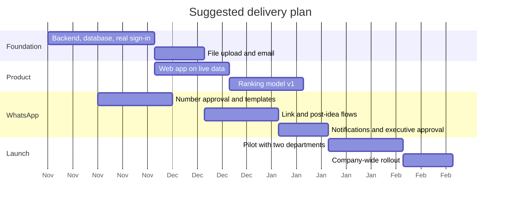

The dates are placeholders to show ordering. Adjust them to your team and to approval times (WhatsApp template approval can take several days).
