# ZB Idea Manager: Documentation

ZB Idea Manager is where verified ZB Group employees post ideas, answer challenges set by executives, and follow each idea from first sketch to launch. Executives rank ideas, approve the best ones and see how the programme is doing. Staff can also use it from WhatsApp.

**Stack:** PHP 8.3 and Laravel 13, Livewire 4 with Blade, Tailwind CSS 4, Alpine.js, a little plain JavaScript, Laravel Reverb for realtime, and Supabase for the database (Postgres) and optionally file storage. The Android app is a Capacitor wrapper around the same web app. There is no separate native, React or Vue codebase: it is PHP, JavaScript and SQL.

> **What is built.** The web app, the executive tools, realtime chat and notifications, the WhatsApp bot (webhook, linking, posting, approving, notifications) and the Capacitor Android project are all in the repository. 26 automated tests pass, including the WhatsApp flows through the real webhook. The database starts **empty**: there is no sample data, and everything in it is created by real users. The original static prototype is kept in `prototype/` for reference.
>
> **Not verified here.** The Android project is generated but was not compiled on the machine this was built on (no Android SDK). The WhatsApp bot was tested against the webhook only, not against a live Meta account. See sections 11 and 12 for the steps.

**Contents**

1. [Overview and roles](#1-overview-and-roles)
2. [Features](#2-features)
3. [Architecture](#3-architecture)
4. [Data model](#4-data-model)
5. [Pages and routes](#5-pages-and-routes)
6. [Key flows](#6-key-flows)
7. [Ranking engine](#7-ranking-engine)
8. [Realtime with Reverb](#8-realtime-with-reverb)
9. [WhatsApp chatbot](#9-whatsapp-chatbot)
10. [Android app (Capacitor)](#10-android-app-capacitor)
11. [Setup and running locally](#11-setup-and-running-locally)
12. [Deployment](#12-deployment)
13. [Configuration reference](#13-configuration-reference)
14. [Testing](#14-testing)
15. [Security and privacy](#15-security-and-privacy)
16. [Project layout](#16-project-layout)
17. [Roadmap and known limitations](#17-roadmap-and-known-limitations)

---

## 1. Overview and roles

| Role | Who | What they can do |
|---|---|---|
| **Employee** | Anyone who signs in | Post ideas with images and documents, like, comment, share, save, chat, answer challenges, use the WhatsApp bot |
| **Executive** | Users with `is_admin = true`, shown with a blue verified tick | Everything an employee can do, plus set challenges, AI ranking, approve ideas, change an idea's stage, insights, user list, email log, approve from WhatsApp |

**For now, anyone can sign in with any email address and can choose to sign in as Employee or Executive admin** (see "Temporary open access" below). Executive status is stored in the database and checked on the server, and an executive can promote or demote other users on the *All users* page.

**Temporary open access.** While the app is being set up, two switches are on so that anyone can try every role:

| Switch | Now | Later |
|---|---|---|
| `IDEAS_EMAIL_DOMAIN` | empty: any email address can sign in | `zb.co.zw` to restrict to ZB staff |
| `IDEAS_ALLOW_ROLE_CHOICE` | `true`: the sign-in page asks Employee or Executive admin and applies it | `false`: executive rights are only changed by an executive on *All users* |

Turn both off before the app holds real decisions: with them on, anyone can approve ideas.

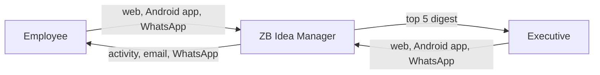

## 2. Features

### For everyone
- **Sign in** with any email address and a 6-digit code sent to it. No passwords. The session lasts until sign-out. Your account is created the first time you sign in, and you can add your role, department and photo under *Edit profile*.
- **Home feed** with *For you* (department, engagement, challenge ideas, freshness) and *Latest*; filter by stage and challenge; search.
- **Idea cards** with author, blue tick for executives, stage tag, summary, image, challenge, documents and like / comment / share / save.
- **Idea page** with stage tracker, images, full text, downloadable documents and comments.
- **Post an idea** with title, summary, details, stage, challenge, photos and documents (PDF, Office files, CSV; up to 10 MB each).
- **Challenges** set by executives, with keywords and a deadline. "Answer this challenge" pre-selects it in the idea form.
- **Chat** one to one, updated live through Reverb. On a phone an open conversation takes the whole screen.
- **Activity** for likes, comments, approvals, stage changes and new challenges, with an unread badge.
- **Members and profiles** with a photo, bio, their ideas and (on your own profile) saved ideas.
- **WhatsApp** to link your number, post ideas, check your ideas, see top ideas and get notified.

### For executives
- **AI ranking** against a chosen challenge with three weight sliders, top five highlighted, approve in one tap, and *Email me the top 5*.
- **Approval** emails the author, adds an Activity item and sends a WhatsApp message if their number is linked.
- **Stage control and a note** on every idea page, and a shortcut to message the author.
- **New challenge** posted to all staff.
- **Insights, All users, Email log.**

### Phone layout
A floating dock (Home, Chat, Activity, Members) with a round **+** button to post an idea. Chat hides the dock and uses a **+** for new chats. The top bar shows the page title, a filter button on Home, search and your avatar menu.

## 3. Architecture

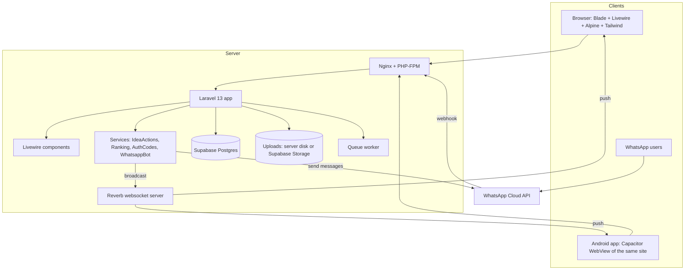

How it fits together
- **Livewire** components are the pages. Each is a PHP class plus a Blade view. Actions such as *like* are PHP methods called with `wire:click`, so there is no separate API and almost no JavaScript.
- **Alpine** handles small browser-only things: the avatar menu, toast messages, scrolling chat to the bottom, native share.
- **Services** hold the rules so the web app and the WhatsApp bot behave the same:
  - `IdeaActions`: create, like, save, comment, stage, approve, post challenge, digest, email log.
  - `Ranking`: the scoring formula.
  - `AuthCodes`: send and check the 6-digit code.
  - `WhatsappBot`: the conversation state machine. `WhatsappClient`: sends messages through the Cloud API.
- **Events** `MessageSent` and `ActivityCreated` are broadcast on private channels. If Reverb is down the app still works; users just need to refresh to see new items.
- **Android** loads the live site inside a native shell. See section 10.

## 4. Data model

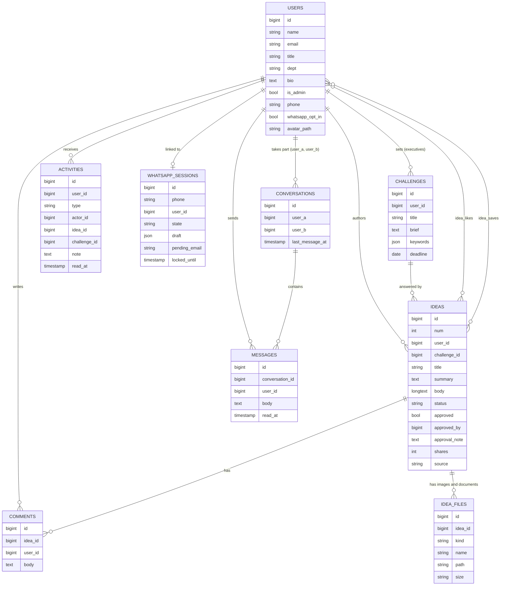

Other tables: `login_codes` (hashed one-time codes with expiry and attempt count), `sent_emails` (the email log), `whatsapp_messages` (message ids for de-duplication, direction, delivery status), plus Laravel's `sessions`, `cache` and `jobs`.

Idea codes are shown as `ZB-IDEA-0141` (from `ideas.num`). Stages are `Idea, Prototype, Demo, Pilot, Launched`; `approved` is a separate flag.

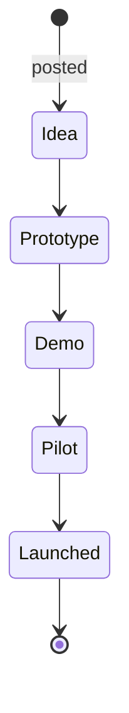

## 5. Pages and routes

| URL | Livewire component | Who |
|---|---|---|
| `/login` | `Auth\Login` | Guests |
| `/` | `Feed` | Signed in |
| `/ideas/create` | `IdeaCreate` | Signed in |
| `/ideas/{idea}` | `IdeaShow` | Signed in |
| `/challenges`, `/challenges/{id}` | `Challenges`, `ChallengeShow` | Signed in |
| `/challenges/create` | `ChallengeCreate` | Executives |
| `/chat/{conversation?}` | `Chat` | Participants only |
| `/activity` | `ActivityFeed` | Signed in |
| `/members`, `/members/{user}` | `Members`, `Profile` | Signed in |
| `/profile/edit` | `ProfileEdit` | Signed in |
| `/executive/ranking` | `Admin\Ranking` | Executives |
| `/executive/insights` | `Admin\Insights` | Executives |
| `/executive/users` | `Admin\Users` | Executives |
| `/executive/emails` | `Admin\Emails` | Executives |
| `GET/POST /webhooks/whatsapp` | `WhatsappWebhookController` | Meta (signature checked) |
| `POST /logout` | closure | Signed in |

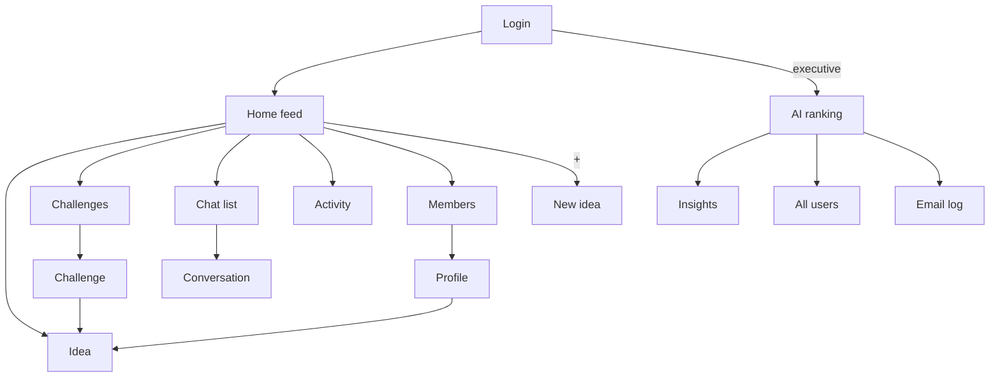

## 6. Key flows

### 6.1 Sign in

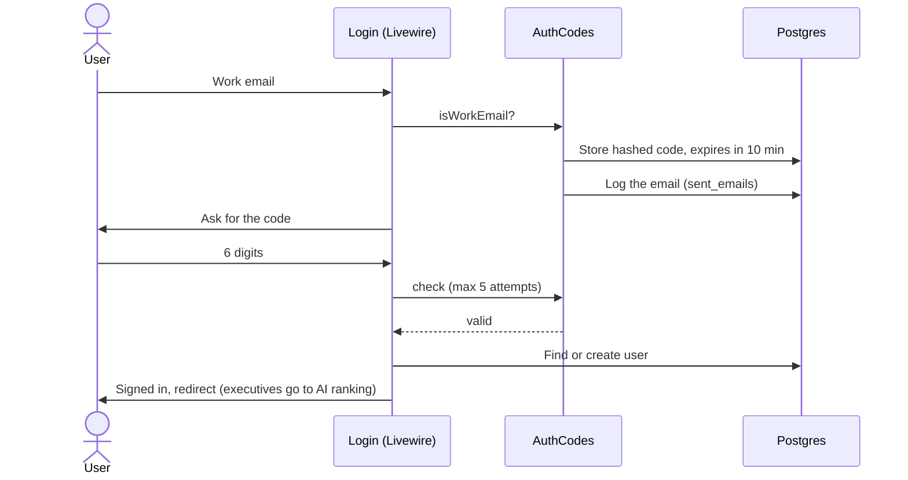

### 6.2 Post, respond, approve

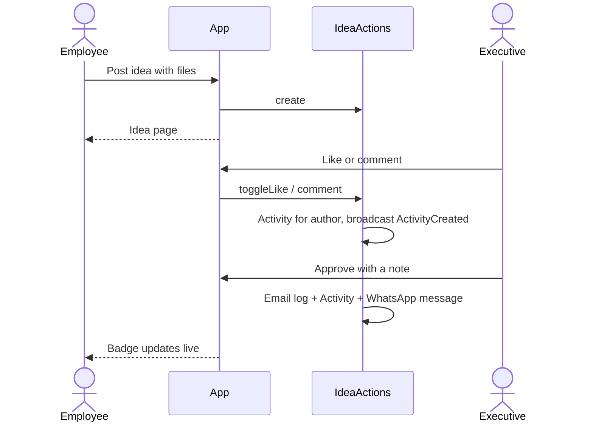

### 6.3 Executive review

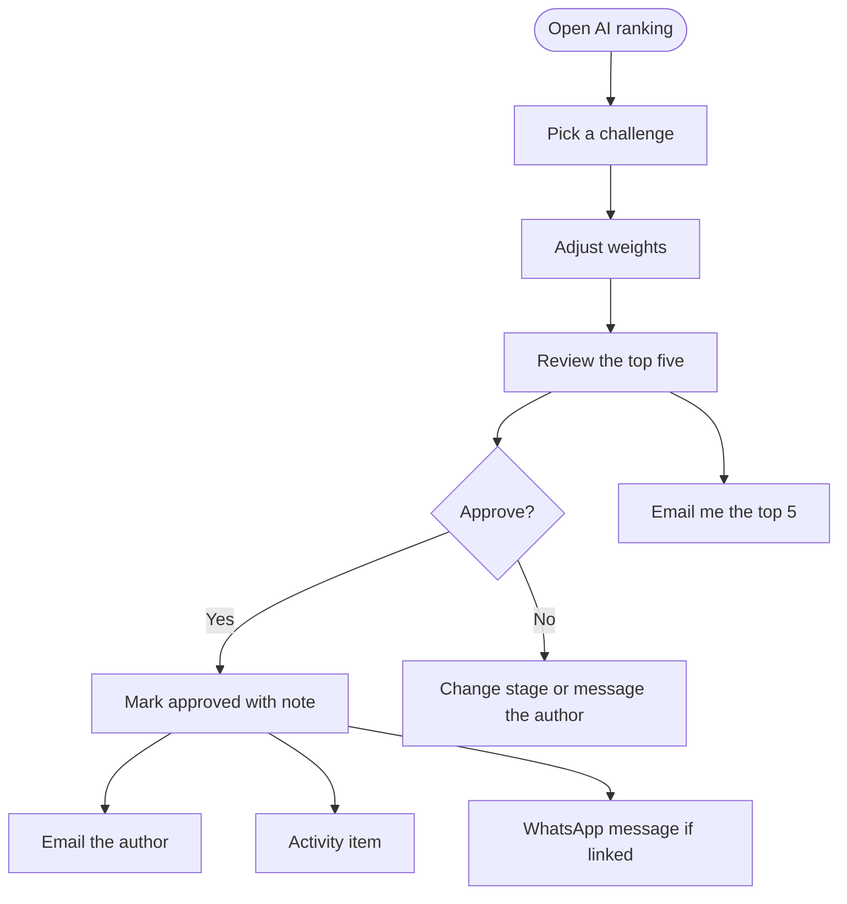

## 7. Ranking engine

Every idea gets three scores from 0 to 100 and a weighted total.

| Score | Calculation |
|---|---|
| **Fit** | Share of the challenge's keywords found in the idea's title, summary and details. Ideas that answered the challenge get a boost. Without a challenge, an idea that belongs to one uses that one; others get 35. |
| **Likes and comments** | `likes + 3 x comments + 2 x shares`, scaled so the most engaged idea scores 100. |
| **Idea quality** | Length of the write-up (up to 45), documents (up to 30) and stage progress (6 per stage). |

`total = (wFit x fit + wEng x engagement + wQuality x quality) / (wFit + wEng + wQuality)`; default weights 40, 35, 25. With a challenge selected, the pool is its ideas plus others whose fit is 45 or more.

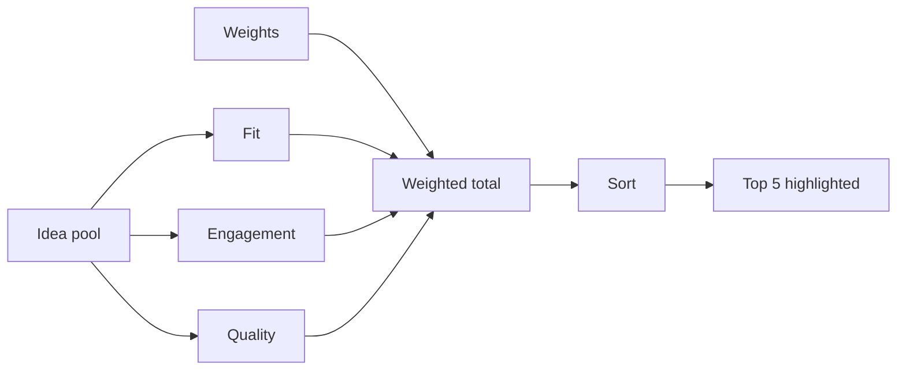

The formula lives in `app/Services/Ranking.php`. It stands in for a trained model: replace the method bodies and keep the three inputs.

## 8. Realtime with Reverb

Laravel Reverb is a websocket server that ships with Laravel. Two events are broadcast on **private** channels, authorised in `routes/channels.php`:

| Event | Channel | Effect |
|---|---|---|
| `MessageSent` | `conversations.{id}` and the receiver's `users.{id}` | New chat messages appear and the Chat badge updates |
| `ActivityCreated` | `users.{id}` | The Activity badge and list update |

The layout subscribes to `users.{your id}` with Laravel Echo and dispatches a Livewire event named `realtime`. Components that listen for it simply re-render.

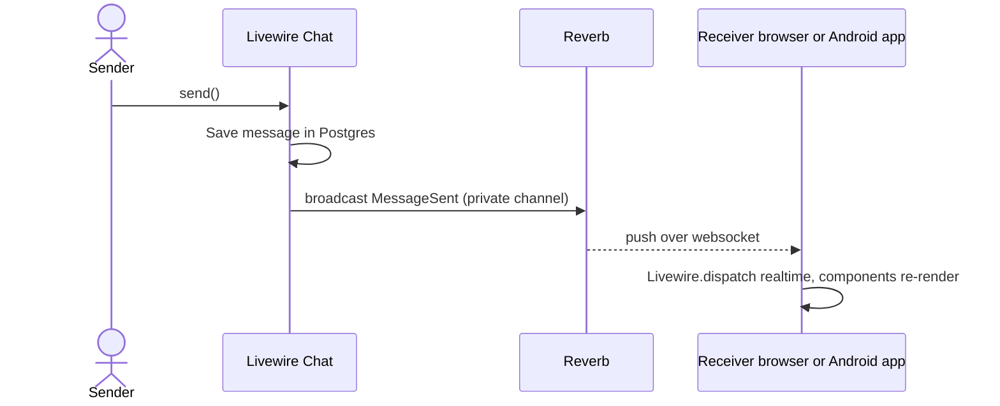

`App\Support\Realtime::send()` wraps every broadcast so a stopped Reverb server never breaks a request.

Run it with `php artisan reverb:start` (see sections 11 and 12).

## 9. WhatsApp chatbot

Staff who are away from a laptop can use the Idea Manager from WhatsApp.

### 9.1 What the bot does

| Say | What happens | Who |
|---|---|---|
| `hi` | If not linked, asks for your email, emails a code, you reply with it. If linked, shows the menu. | All |
| `new idea` | Asks for title (max 90 characters), summary (max 300), details, challenge (list), then Post / Edit / Cancel. Photos and documents are added later on the web. | All |
| `my ideas` | Your latest ideas with stage, likes, comments and approval | All |
| `top ideas` | Top five with a **Like** button each | All |
| `challenges` | Open challenges and deadlines | All |
| `top 5` | Ranked list with an **Approve** button, then a note, then Yes / No | Executives |
| `continue` | Resume an unfinished idea draft | All |
| `cancel`, `menu` | Back to the start | All |
| `stop` / `start notifications` | Turn WhatsApp notifications off or on | All |
| `unlink` | Remove your number | All |
| `help` | List of commands | All |

### 9.2 Components

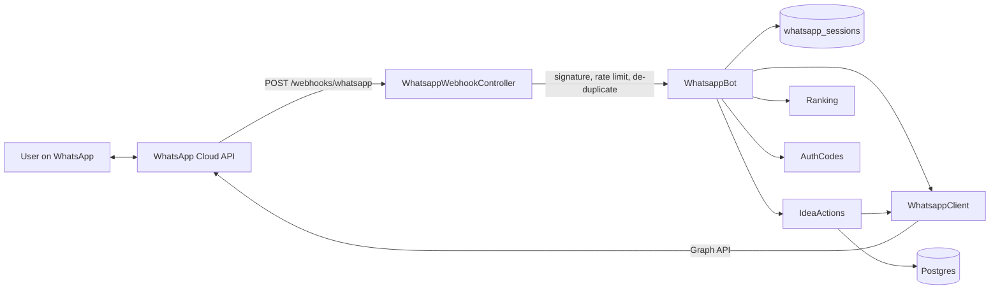

### 9.3 Linking a number

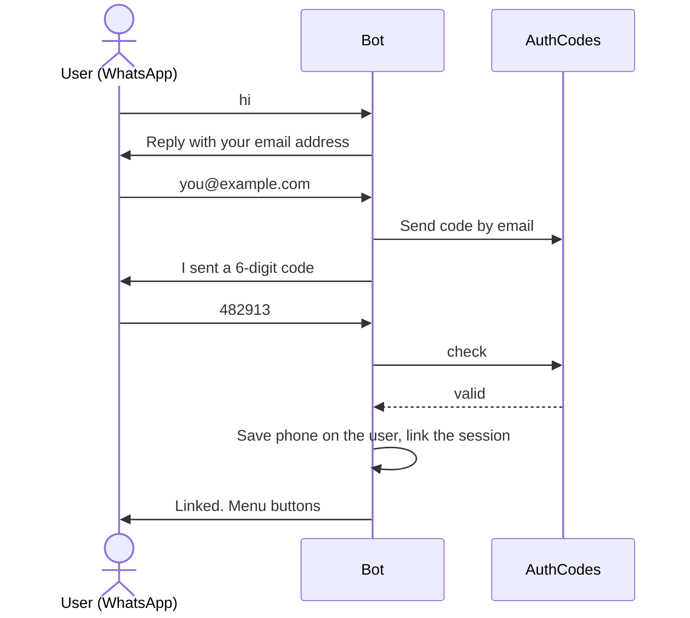

Five wrong codes lock the number for 30 minutes. One number belongs to one user; linking a number that was on another account moves it.

### 9.4 Posting an idea by chat

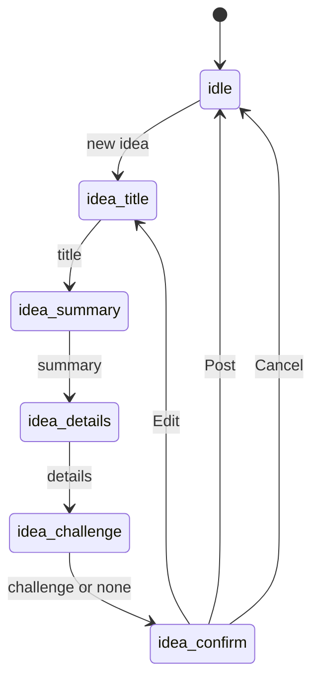

A session that is silent for 30 minutes goes back to idle but keeps the draft so the user can say `continue`. Ideas posted this way carry the label "Posted from WhatsApp".

### 9.5 Executive approval

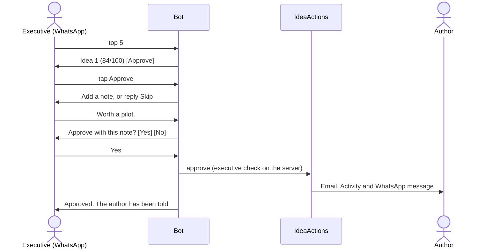

### 9.6 Notifications

WhatsApp allows free text only within 24 hours of the user's last message. Otherwise a **template** that Meta has approved must be used. `WhatsappClient::notifyApproved()` picks the right one.

| Event | Sent as | Template name (env) |
|---|---|---|
| Idea approved | Free text inside 24 hours, otherwise template | `WHATSAPP_TPL_APPROVED` (default `idea_approved`) with three variables: first name, idea code, note |

Suggested template body: `Good news {{1}}: your idea {{2}} was approved. Note: {{3}}`. Users who send `stop`, or switch it off on *Edit profile*, receive nothing.

### 9.7 Message routing

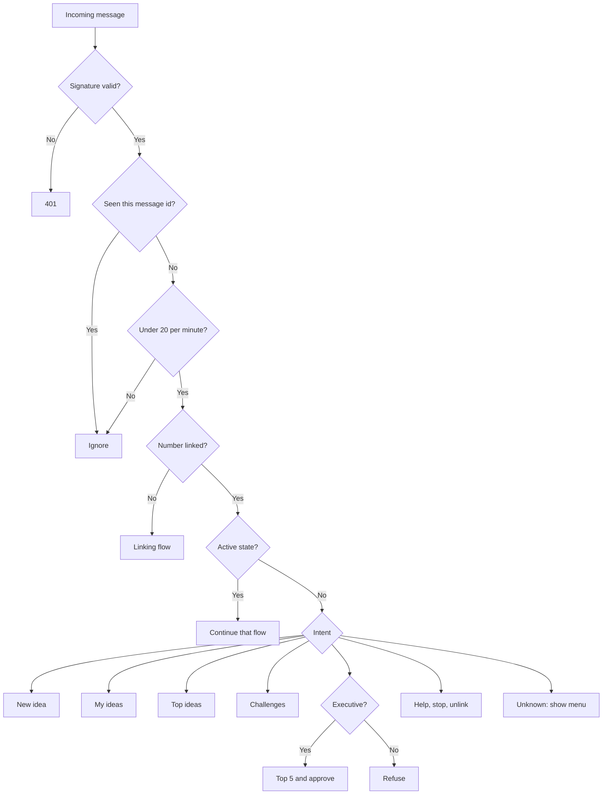

### 9.8 Setting it up with Meta

1. Create a **Meta Business** account and a **WhatsApp Business** app, and add a phone number. Note the **Phone number ID**.
2. Create a permanent **access token** (system user) and copy the **App secret**.
3. In `.env` set `WHATSAPP_TOKEN`, `WHATSAPP_PHONE_NUMBER_ID`, `WHATSAPP_APP_SECRET` and a long random `WHATSAPP_VERIFY_TOKEN`.
4. In the Meta dashboard add the webhook `https://YOUR-DOMAIN/webhooks/whatsapp`, use the same verify token, and subscribe to **messages**.
5. Create and submit the message template `idea_approved` (category Utility) with three variables.
6. With no token set the app only logs outgoing messages, so everything else can be developed without a Meta account.

For local testing expose your machine with a tunnel (for example `ngrok http 8000`) and use that URL for the webhook. Unsigned requests are accepted only in `local` and `testing` environments; with an app secret set, every request must carry a valid `X-Hub-Signature-256`.

## 10. Android app (Capacitor)

The Android app is a native shell that loads the Laravel site in a WebView. All features (including WhatsApp linking, uploads and realtime) work because it is the same site.

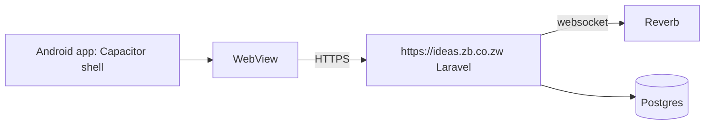

Configuration is in `capacitor.config.json`:

| Setting | Value |
|---|---|
| `appId` | `zw.co.zb.ideas` |
| `appName` | ZB Ideas |
| `server.url` | The address of the live site. **Change this to your real domain.** |
| `webDir` | `mobile/www` (a small offline page shown only if the server cannot be reached) |
| Plugins | `@capacitor/splash-screen`, `@capacitor/status-bar` (ZB green) |

The native project is in `android/`. The layout already respects phone safe areas (`viewport-fit=cover`, `env(safe-area-inset-*)`).

### Build and run

Needs Android Studio (or the Android SDK) and JDK 21.

```bash
npm install
npm run android:sync     # copy config into the Android project
npm run android:open     # open in Android Studio, then Run
npm run android:build    # debug APK: android/app/build/outputs/apk/debug
```

### Trying it against your computer

The emulator reaches your machine at `10.0.2.2`. In `capacitor.config.json` temporarily set:

```json
"server": { "url": "http://10.0.2.2:8000", "cleartext": true }
```

Run `php artisan serve`, then `npm run android:sync` and run the app. Change it back before building a release.

### Release

1. Set the real `server.url` (HTTPS only, `cleartext: false`).
2. Replace the icons and splash images under `android/app/src/main/res`.
3. In Android Studio choose *Build, Generate Signed Bundle*, create a keystore and keep it safe.
4. Upload the `.aab` to Google Play (or distribute the signed APK inside ZB).

### Optional next step: push notifications

Add `@capacitor/push-notifications` with Firebase, store each device token against the user, and send a push from `IdeaActions::notify()` next to the WhatsApp message. Until then the app updates live while open, and WhatsApp covers away-from-app alerts.

## 11. Setup and running locally

**Requirements:** PHP 8.3 (extensions: curl, fileinfo, mbstring, openssl, pdo_pgsql, sodium, zip, intl, gd), Composer, Node 20+, and a free Supabase project (the tests use SQLite and need no database).

### Supabase setup

1. Create a project at supabase.com. Save the **database password**.
2. Open **Connect** in the dashboard and copy the connection strings into `.env` **under the names Supabase uses**. If you use the Supabase integration on Vercel, those variables are created for you.

   | `.env` name | What it is | Used for |
   |---|---|---|
   | `POSTGRES_URL_NON_POOLING` | Direct or session-pooler string, port 5432 | **Preferred.** Works with everything, including migrations |
   | `POSTGRES_URL` | Pooled string, port 6543 ("transaction mode") | Fallback for hosts that cannot reach the direct string. The app then sends plain queries, because this pooler has no prepared statements |
   | `DB_URL` | Any connection string | Overrides both, if you want to set it by hand |
   | `POSTGRES_HOST`, `POSTGRES_USER`, `POSTGRES_PASSWORD`, `POSTGRES_DATABASE` | The parts of the string | Only if you do not use a URL. `DB_HOST`, `DB_PORT`, `DB_USERNAME`, `DB_PASSWORD`, `DB_DATABASE` also work |

   Keep `DB_CONNECTION=pgsql` and `DB_SSLMODE=require`. If you only have a pooled string, use the session pooler (port 5432) from the Connect page for `php artisan migrate`.
3. Create the empty tables, with **either** option (not both):
   - `php artisan migrate`, or
   - paste `database/schema/zb_ideas.postgres.sql` into the Supabase **SQL editor** and run it. It also records the migrations as applied, so a later `php artisan migrate` does nothing.
4. Both options switch on **row level security** for every table with no policies. Supabase exposes tables in the `public` schema through its REST API; this keeps your data unreadable through the public API keys. Laravel connects as the `postgres` role, which bypasses RLS, so the app is unaffected. Any table you add later needs `alter table "name" enable row level security;`.
5. Do not use Supabase Auth, the Data API or Realtime for this app. Laravel handles sign-in, the Livewire pages and Reverb itself, and uses Supabase only as the database (and optionally file storage).

### Run the app

```bash
composer install
cp .env.example .env && php artisan key:generate   # then fill in DB_*
php artisan migrate              # creates the empty tables. No data is added.
php artisan storage:link         # only if uploads stay on the server disk
npm install
npm run build                    # or: npm run dev
php artisan serve                # http://localhost:8000
```

For a quick try you can set `IDEAS_ACCEPT_ANY_CODE=true` so any 6 digits sign you in.

### Uploads on Supabase Storage (optional)

By default uploads go to the server's `public` disk. That is fine on a normal server, but disks on many hosts are wiped on every deploy, so for production put uploads in Supabase Storage:

1. In Supabase **Storage**, create a **public** bucket called `uploads`.
2. In **Storage, S3 Connection**, create an access key. Copy the key id and the secret.
3. Set in `.env`: `IDEAS_UPLOAD_DISK=supabase`, `SUPABASE_URL` (your project URL), `SUPABASE_STORAGE_BUCKET=uploads`, `SUPABASE_STORAGE_ACCESS_KEY_ID` and `SUPABASE_STORAGE_SECRET_ACCESS_KEY`. The S3 endpoint and the public file links are built from `SUPABASE_URL`.

Files in a public bucket can be opened by anyone who has the link (the links are long and unguessable, but not secret). Documents that must stay private need a private bucket and signed links, which is a later step.

**Database template.** `database/schema/zb_ideas.postgres.sql` holds the empty tables as plain Postgres statements. After you change a migration, regenerate it with `php artisan schema:sql`.

The database starts empty. Open the site, enter any email and the 6-digit code, and your account is created. The first people to sign in choose Employee or Executive admin on the sign-in page. Executives can then post a challenge, and everyone can post ideas.

For realtime, generate Reverb keys (`php artisan reverb:install` or fill the `REVERB_*` values yourself) and run in extra terminals:

```bash
php artisan reverb:start
php artisan queue:work           # only needed if you add queued jobs
```

The code is emailed through your mail transport. In the `local` environment it is also written to `storage/logs/laravel.log` and to the *Email log* (executive page).


## 12. Deployment

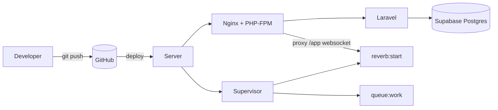

Checklist
1. Server with PHP 8.3 (with `pdo_pgsql`), Nginx, Node (for the build), Supervisor, and a Supabase project for the database.
2. `composer install --no-dev --optimize-autoloader`, `npm ci && npm run build`.
3. Production `.env`: `APP_ENV=production`, `APP_DEBUG=false`, `APP_URL`, the Supabase connection (`POSTGRES_URL_NON_POOLING`), `IDEAS_UPLOAD_DISK=supabase` with the `SUPABASE_*` values, `IDEAS_ACCEPT_ANY_CODE=false`, real mail settings (`MAIL_MAILER=smtp` and so on), Reverb host and keys, WhatsApp variables.
4. `php artisan migrate --force`, `php artisan storage:link`, `php artisan config:cache route:cache view:cache`.
5. Supervisor keeps `php artisan reverb:start` and `php artisan queue:work` running.
6. HTTPS everywhere. Proxy the websocket path (`/app`) to Reverb and set `REVERB_SCHEME=https`, `REVERB_PORT=443`.
7. Point the Android app's `server.url` and the Meta webhook at the same domain.

Do not run `migrate:fresh` in production: it deletes all data. `php artisan migrate --force` is safe, it only adds new tables and columns.

## 13. Configuration reference

| Variable | Purpose |
|---|---|
| `POSTGRES_URL_NON_POOLING`, `POSTGRES_URL`, `DB_URL` | Supabase Postgres connection string (first one set wins). `POSTGRES_HOST/USER/PASSWORD/DATABASE` or `DB_*` parts also work. `DB_SSLMODE=require` |
| `IDEAS_EMAIL_DOMAIN` | Restrict sign-in to one domain, for example `zb.co.zw`. **Empty means any email can sign in (current setting).** |
| `IDEAS_ACCEPT_ANY_CODE` | Demo only: accept any 6 digits. **Keep false in production.** |
| `IDEAS_ALLOW_ROLE_CHOICE` | Temporary: the sign-in page lets people pick Employee or Executive admin. **Set false before real use.** |
| `IDEAS_AUTO_PROVISION` | Create an account on first valid sign-in. Turn off once you import staff or sync a directory |
| `IDEAS_UPLOAD_DISK` | `public` (server disk) or `supabase` (Supabase Storage via S3) |
| `SUPABASE_URL`, `SUPABASE_STORAGE_BUCKET`, `SUPABASE_STORAGE_ACCESS_KEY_ID`, `SUPABASE_STORAGE_SECRET_ACCESS_KEY`, `SUPABASE_STORAGE_REGION` | Supabase Storage (only when uploads use Supabase). `SUPABASE_ANON_KEY` and `SUPABASE_SERVICE_ROLE_KEY` are not used by this app |
| `MAIL_*` | Mail transport. Codes and approvals are always saved to the email log, and sent when a real mailer is configured |
| `BROADCAST_CONNECTION` | `reverb` |
| `REVERB_*`, `VITE_REVERB_*` | Websocket server keys and host |
| `WHATSAPP_TOKEN`, `WHATSAPP_PHONE_NUMBER_ID` | Cloud API credentials |
| `WHATSAPP_APP_SECRET` | Signature check for incoming webhooks |
| `WHATSAPP_VERIFY_TOKEN` | Webhook registration handshake |
| `WHATSAPP_TPL_APPROVED` | Template name for approval notices |

Fixed limits are in `config/ideas.php`: code lifetime 10 minutes, 5 attempts, 30-minute lockout, 30-minute bot session, 20 WhatsApp messages per minute per number.

> Every email (codes, approvals, digests) is saved to the `sent_emails` table and sent through Laravel's mailer. With `MAIL_MAILER=log` it is only written to the log; set `smtp` (or another mailer) to deliver it. A mail failure is reported but never blocks sign-in or approvals.

## 14. Testing

```bash
php artisan test
```

26 tests run against an in-memory SQLite database. They load a small set of sample people and ideas from `tests/Fixtures` so there is something to test; the real database never gets this data:

| Area | What is checked |
|---|---|
| Access | Guests are sent to login; employees get 403 on executive pages; chats are private |
| Sign in | Wrong code rejected, right code signs in, non-ZB emails refused |
| Feed and ideas | Seeded ideas and images render, search, like toggles and notifies the author, comments notify, posting with a document and an image |
| Executive | Approval emails the author and adds an Activity item, the digest is logged, employees cannot approve, ranking order |
| Empty database | The default seeder adds nothing, and every page renders with no data at all |
| Chat | Sending a message |
| WhatsApp | Webhook handshake, unsigned requests rejected, linking by emailed code, posting an idea by chat, cancel, employees blocked from executive commands, executive approval end to end, stop and unlink, lockout after wrong codes, duplicate deliveries ignored |

Tests post real payloads to `/webhooks/whatsapp`, the same shape Meta sends.

## 15. Security and privacy

- Sign-in uses hashed, expiring, attempt-limited codes sent to the email address, and sessions are regenerated on login. Domain restriction is available (`IDEAS_EMAIL_DOMAIN`) but off for now. **While the temporary role choice is on, anyone can make themselves an executive.**
- Executive rights come from the database and are enforced by middleware and inside `IdeaActions::approve()`. WhatsApp approvals pass through the same check.
- Webhook requests are verified with HMAC-SHA256, de-duplicated by message id and rate limited per number.
- A WhatsApp number is linked only after the user proves they own the email. Unlinked numbers can do nothing but link.
- Chat channels are authorised per participant; opening someone else's conversation returns 403.
- Uploads are limited by type and size and stored on the `public` disk. For stricter control, move documents to a private disk and serve them through a signed route, and add malware scanning.
- Keep customer data out of ideas and chats. Phone numbers and message ids are the only WhatsApp data stored; message text is not kept.
- Notifications are opt-in per user (profile switch or `stop`).

## 16. Project layout

```
app/
  Events/                 MessageSent, ActivityCreated (broadcast)
  Http/Controllers/       WhatsappWebhookController
  Http/Middleware/        EnsureExecutive
  Livewire/               one class per page (Feed, IdeaShow, Chat, Admin/Ranking, ...)
  Models/                 User, Idea, Challenge, Comment, IdeaFile, Conversation, Message, Activity, ...
  Services/               IdeaActions, Ranking, AuthCodes, WhatsappBot, WhatsappClient
  Support/Realtime.php    safe broadcast helper
config/ideas.php          app settings and WhatsApp settings
database/
  migrations/             schema
  schema/zb_ideas.postgres.sql   empty Postgres template for Supabase (generated by `php artisan schema:sql`)
  seeders/                DatabaseSeeder (intentionally empty)
resources/
  css/app.css             Tailwind theme and small component classes
  js/app.js, echo.js      Echo / Reverb client
  views/layouts/          app (sidebar, top bar, dock), guest
  views/components/       icon, avatar, verified, stage, idea-card, idea-actions
  views/livewire/         page templates
routes/                   web.php, channels.php
tests/Feature/            WebAppTest, WhatsappBotTest, EmptyDatabaseTest
tests/Fixtures/           sample data used only by the tests
android/                  Capacitor Android project
capacitor.config.json     Android app settings
mobile/www/               offline fallback page for the Android shell
prototype/                the original single-file prototype, kept for reference
docs/                     this document
```

## 17. Roadmap and known limitations

**Before go-live**
- Set a real mail transport (`MAIL_*`) and the other production environment values.
- Turn off the open access switches (`IDEAS_ALLOW_ROLE_CHOICE=false`, set `IDEAS_EMAIL_DOMAIN`), and assign real executives on the *All users* page.
- Compile and test the Android app on a device and ship a signed build.
- Register the WhatsApp number, get the `idea_approved` template approved and test with a live account.
- Move documents to a private disk and add malware scanning.

**Known limitations**
- The ranking is a weighted formula, not a trained model.
- The WhatsApp bot handles text and button taps; photos and documents sent in WhatsApp are not yet attached to ideas (the bot points the user to the web app).
- WhatsApp notifications are implemented for approvals. Comments, new challenges and a daily top 5 can be added the same way in `IdeaActions::notify()`.
- Push notifications on Android are not set up (see section 10).
- Uploads live on the server disk unless you switch to Supabase Storage (see section 11). Files in a public bucket are reachable by anyone with the link.

**Suggested plan**

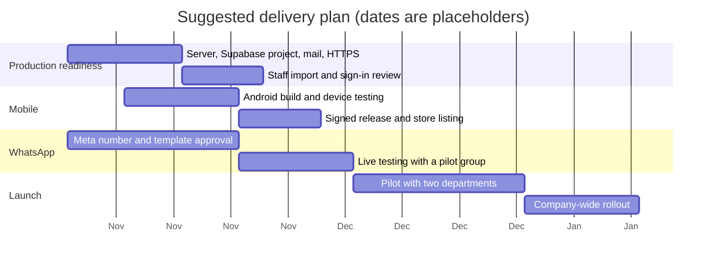
