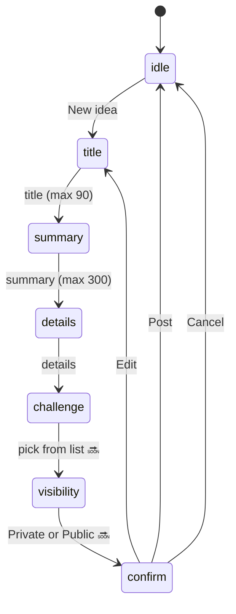
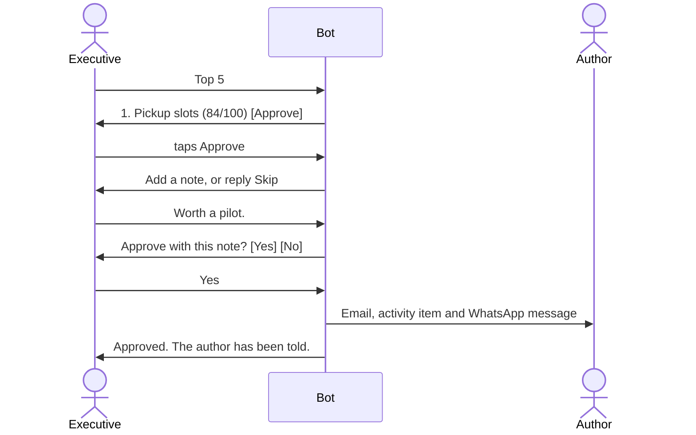

# ZB Idea Manager on WhatsApp

How staff and executives use the Idea Manager from WhatsApp. This page covers what the bot says and does, which menus use **buttons** and which use **lists**, and how to set it up.

> **Status key.** ✅ = built and tested (`app/Services/WhatsappBot.php`). 🔜 = designed here, not built yet. Section 9 of [DOCUMENTATION.md](DOCUMENTATION.md) has the technical overview; this page is the user-facing guide and the menu design.

## 1. At a glance

| I want to… | Who | Say or tap | Status |
|---|---|---|---|
| Start (no email, no code) | Everyone | Already registered with Smile Factory? Just say `hi` | ✅ |
| Open the web app | Everyone | `web`, then tap the link | ✅ |
| Post an idea | Everyone | **New idea** | ✅ (privacy question 🔜) |
| See my ideas | Everyone | **My ideas** | ✅ |
| See top ideas and like them | Everyone | **Top ideas** → **Like** | ✅ |
| Browse open challenges | Everyone | **Challenges** | ✅ text, 🔜 list with detail |
| See ideas on a challenge, with likes | Executives | **Challenges** → pick one → **Ideas** | 🔜 |
| Get a report | Executives | **Reports** | 🔜 |
| Rank and approve ideas | Executives | **Top 5** → **Approve** | ✅ |

## 2. Buttons or lists?

WhatsApp allows two kinds of tap-to-answer messages. The bot picks by how many choices there are.

| Kind | Limit | Used for |
|---|---|---|
| **Reply buttons** | Up to 3, titles up to 20 characters | Main menu, Post / Edit / Cancel, Yes / No, Like, Approve, Public / Private |
| **List menu** | Up to 10 rows, titles up to 24 characters | Choosing a challenge, choosing an idea, choosing a report |
| Plain text | Free typing | Titles, summaries, details and notes |

Typed commands always work too (`new idea`, `challenges`, `help`), so nobody is forced to tap.

## 3. Everyone

### 3.1 Signing in (through Smile Factory)

There is no email address, password or emailed code in this app. People register with the **Smile Factory chatbot**, which has already verified their WhatsApp number. The Idea Manager sits on top of that chatbot: your number is your identity.

```
Smile Factory:  Thank you for confirming. Your registration is complete. Welcome to Smile Factory!
You:            hi
Bot:            What would you like to do?
                [ New idea ] [ My ideas ] [ Top ideas ]
```

- **First message from a number:** an account is created automatically, named from the WhatsApp profile name, with the tag **General**. Nothing is asked.
- **Web app:** send `web` and the bot replies with a sign-in link. It works **once** and expires after **10 minutes**. The web sign-in page shows the same three steps and an **Open WhatsApp** button.

```
You:  web
Bot:  Open the web app (link works once, for 10 minutes):
      https://…/wa-login/Zk3…
```

- **Tags and executives:** everyone starts as **General**. Executive rights are not self-service; an administrator sets them in the database.
- **Placeholder email:** accounts made from a number get an address like `2637…@whatsapp.invalid`. Nothing is ever sent to it, so email-only notifications do not reach these people; WhatsApp does.

> **Not built yet 🔜.** Reading the person's Smile Factory details (full name, email, category such as Student) from the registration chatbot. It needs a handover from Smile Factory, either a shared record or an API, which this repository does not have yet. Until then the name comes from the WhatsApp profile and the tag is General.

### 3.2 Main menu

Buttons allow only three choices, so the menu is a button row for the everyday actions and a list for the rest.

```
Bot:  What would you like to do?
      [ New idea ] [ My ideas ] [ More… ]
You:  taps More…
Bot:  ┌ Options ───────────────┐
      │ Top ideas              │
      │ Challenges             │
      │ Top 5 to approve   (executives only) │
      │ Reports            (executives only) │
      └────────────────────────┘
```

Today the menu is `New idea / My ideas / Top ideas` ✅. The **More…** list is 🔜 and brings **Challenges** and the executive items into the menu so nobody has to remember the words.

### 3.3 Posting an idea ✅



```
Bot:  What is your idea called? (Send "cancel" to stop.)
You:  Pre-booked cash pickup slots
Bot:  Summarise it in two sentences.
You:  Customers book a 15-minute slot at a branch…
Bot:  Tell me the details. What is the problem and how does your idea fix it?
You:  Queues at month end are over an hour…
Bot:  Which challenge does it answer?          ← list menu
      [ Choose ]  None · Cut branch queues · Digital savings …
You:  taps "Cut branch queues"
Bot:  Who can see this idea?                    ← 🔜
      [ Private ] [ Public ]
You:  taps Public
Bot:  ⚠ Everyone at ZB will be able to view this idea.   ← 🔜 subtle warning, Public only
Bot:  Ready to post?
      Pre-booked cash pickup slots
      Customers book a 15-minute slot…
      Challenge: Cut branch queues
      Visibility: Public
      [ Post ] [ Edit ] [ Cancel ]
You:  taps Post
Bot:  Posted as ZB-IDEA-0042. You will be told here when someone responds.
      https://…/ideas/42
```

- Photos and documents are added later on the web.
- A session silent for 30 minutes goes back to idle but keeps the draft. Say `continue` to resume.
- **Privacy.** Ideas are **private by default** (only you and executives can see them). Until the 🔜 question above is added, ideas posted from WhatsApp are private. Change it with **Edit** on the web.
- Ideas posted this way carry the label "Posted from WhatsApp".

### 3.4 My ideas ✅

```
Bot:  ZB-IDEA-0042 Pre-booked cash pickup slots
      Idea · 5 likes · 2 comments

      ZB-IDEA-0038 Branch queue tickets
      Pilot, approved · 18 likes · 6 comments
```

### 3.5 Top ideas ✅

One message per idea (top five) with a **Like** button. Tapping again removes the like. You only see ideas you are allowed to see: public ones, your own, and projects you are tagged on.

### 3.6 Challenges

Today ✅: a text list of open challenges with deadlines. Designed 🔜:

```
Bot:  Open challenges
      [ Choose ]  Cut branch queues (12 days) · Digital savings (30 days) …
You:  taps "Cut branch queues"
Bot:  Cut branch queues
      Set by Chipo Dube · closes 20 Oct · 9 ideas
      [ Post an idea ] [ Back ]                      ← employees
      [ View ideas ] [ Post an idea ] [ Back ]       ← executives
```

**Post an idea** starts the flow in 3.3 with this challenge already chosen.

## 4. Executives

Executives are users with admin rights on the web app. The bot checks this on the server, so a non-executive who types an executive command is told it is not available.

### 4.1 Top 5 and approving ✅



### 4.2 Ideas on a challenge, with likes 🔜

```
Bot:  Cut branch queues · 9 ideas
      [ Choose ]  Pickup slots · 18 ♥ · Queue tickets · 11 ♥ · Teller app · 7 ♥ …
You:  taps "Pickup slots · 18 ♥"
Bot:  ZB-IDEA-0042 Pre-booked cash pickup slots
      by Tinashe Moyo · Pilot · 18 likes · 6 comments · 84/100
      Customers book a 15-minute slot at a branch…
      [ Approve ] [ Like ] [ Back ]
```

- The list is sorted by likes, highest first, with the like count in each row title.
- Executives see **every** idea, private or public. Everyone else is limited to what they can see on the web.
- Rows hold 10 at most, so a challenge with more ideas shows the top 10 and a link to the web page for the rest.

### 4.3 Reports 🔜

```
You:  taps Reports
Bot:  Which report?
      [ Choose ]  Programme summary · Top 10 by likes · Awaiting approval · Idea by stage · By challenge
```

| Report | What the message contains |
|---|---|
| Programme summary | Ideas, approved, likes, comments, ideas from WhatsApp, people active this week |
| Top 10 by likes | Rank, title, author, likes |
| Awaiting approval | Ideas not yet approved, newest first, each with an **Approve** button |
| Ideas by stage | Count per stage: Idea, Prototype, Demo, Pilot, Launched |
| By challenge | Each challenge with its idea count and total likes |

The numbers come from the same queries as the web **Insights** and **Ranking** pages, so both always agree. A report message is capped at 4,000 characters; the bot ends long ones with a link to the web page.

## 5. Notifications

- **Approval.** When an executive approves your idea you get a WhatsApp message (and an email, if the account has a real one).
- **24-hour rule.** WhatsApp allows free text only within 24 hours of your last message. Outside that, the bot sends a Meta-approved **template** (`WHATSAPP_TPL_APPROVED`, default `idea_approved`, with three variables: first name, idea code, note).
- **Opt out and in.** `stop` turns notifications off; `start notifications` turns them on.

## 6. Command reference

| Say | Result |
|---|---|
| `hi`, `menu`, `start` | Menu (or linking if not linked) |
| `new idea` | Start posting |
| `continue` | Resume an unfinished draft |
| `my ideas`, `top ideas`, `challenges` | As above |
| `top 5` | Executives: ranked list with Approve |
| `cancel` | Stop and drop the draft |
| `stop` / `start notifications` | Notifications off / on |
| `web` | Sign-in link for the web app |
| `help` | List of commands |

## 7. Setup

1. Create a Meta app with the **WhatsApp** product and a test or production phone number.
2. Set these in `.env` (all in `config/ideas.php`):

   | Variable | Purpose |
   |---|---|
   | `WHATSAPP_DISPLAY_NUMBER` | The number people message, digits only (for the Open WhatsApp button) |
   | `WHATSAPP_TOKEN` | Permanent access token |
   | `WHATSAPP_PHONE_NUMBER_ID` | The sending number's id |
   | `WHATSAPP_VERIFY_TOKEN` | Any secret string, also entered in Meta |
   | `WHATSAPP_APP_SECRET` | Used to check Meta's request signature |
   | `WHATSAPP_API_VERSION` | Defaults to `v21.0` |
   | `WHATSAPP_TPL_APPROVED` | Name of the approved template |

3. In Meta, set the webhook callback to `https://<your-domain>/webhooks/whatsapp`, enter the verify token and subscribe to **messages**.
4. Submit the `idea_approved` template for approval (body with three variables).
5. With no token set, the bot only logs messages, so you can develop without a Meta account.

Requests are checked against the app signature, rate limited (20 per minute per number) and de-duplicated by message id.

## 8. Security notes

- Executive commands and approvals are checked on the server, not just hidden from the menu.
- Private ideas never appear in lists or buttons for people who are not allowed to see them.
- Sign-in trusts the WhatsApp number that Meta delivers. Every webhook call is checked against `WHATSAPP_APP_SECRET`, so set it in production; without it, anyone could post a fake message "from" any number.
- Web sign-in links are random, single use and expire after 10 minutes. Anyone holding the phone can use a fresh link, as with any WhatsApp-based sign-in.

## 9. Build list for the 🔜 items

1. **More…** list in the main menu, with executive-only rows.
2. Challenge list → detail (Post an idea, View ideas).
3. Public / Private question and warning in the posting flow.
4. Executive challenge idea list sorted by likes, with idea detail, **Approve** and **Like**.
5. **Reports** list and the five report messages.
6. Tests for each, through the real webhook like the existing bot tests.
